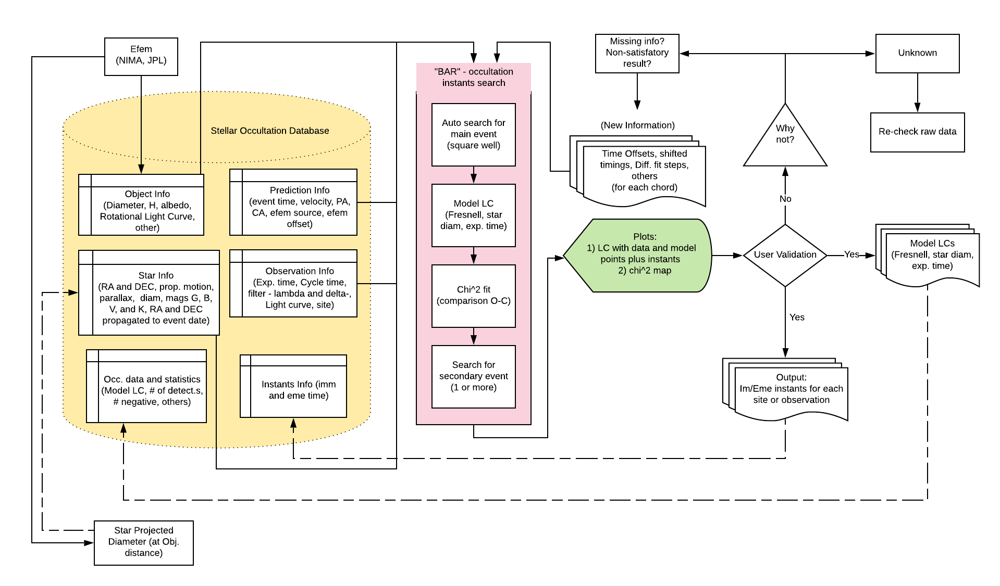
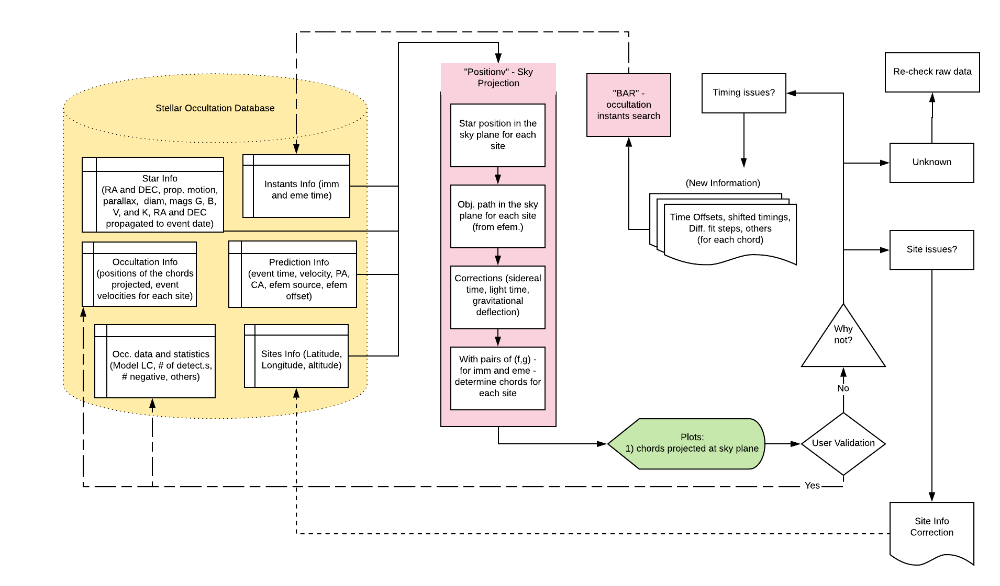
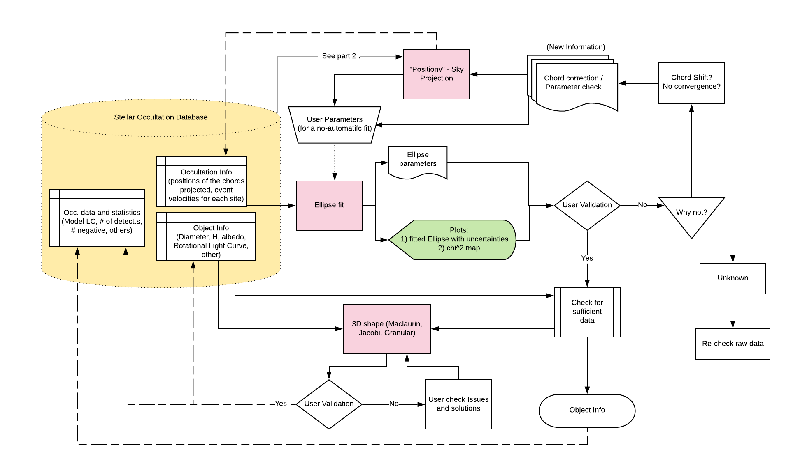

.. _Sec:future_linea:

The future and the LIneA TNO Portal
===================================

The sora package was developed to be the base of the LIneA TNO Portal
with respect to the stellar occultation data analysis. A detailed
workflow of the intended portal is presented in three parts, in
Fig. `2 <#fig:pipeline_workflow_SORA_P1>`__,
Fig. `3 <#fig:pipeline_workflow_SORA_P2>`__, and
Fig. `4 <#fig:pipeline_workflow_SORA_P3>`__. The first part presents the
pipeline workflow starting with the big occultation database that will
contain many of the input values for the program that will calculate the
instants for immersion and emersion. The second part shows all the
processes to calculate the projected chords obtained from each
observation. The third part shows the final step which fit an ellipse
and obtain the object 3D shape (if enough information is available).
Note that there is always user validation for outputs and plots.

   database and the process to calculate the instants for immersion and
   emersion. Note that there is always user validation for outputs and
   plots before finishing the process and re-feed the database with
   output data.
   :name: fig:pipeline_workflow_SORA_P1
   :width: 150.0%

   First part of the pipeline workflow with the big occultation database
   and the process to calculate the instants for immersion and emersion.
   Note that there is always user validation for outputs and plots
   before finishing the process and re-feed the database with output
   data.

   database and the process to calculate the projected chords obtained
   from each observation. Note that there is always user validation for
   outputs and plots before finishing the process and re-feed the
   database with output data.
   :name: fig:pipeline_workflow_SORA_P2
   :width: 150.0%

   Second part of the pipeline workflow with the big occultation
   database and the process to calculate the projected chords obtained
   from each observation. Note that there is always user validation for
   outputs and plots before finishing the process and re-feed the
   database with output data.

   database and the process to fit an ellipse on the observation points
   and obtain the object 3D shape (if enough information is available).
   Note that there is always user validation for outputs and plots
   before finishing the process and re-feed the database with output
   data.
   :name: fig:pipeline_workflow_SORA_P3
   :width: 150.0%

   Third part of the pipeline workflow with the big occultation database
   and the process to fit an ellipse on the observation points and
   obtain the object 3D shape (if enough information is available). Note
   that there is always user validation for outputs and plots before
   finishing the process and re-feed the database with output data.