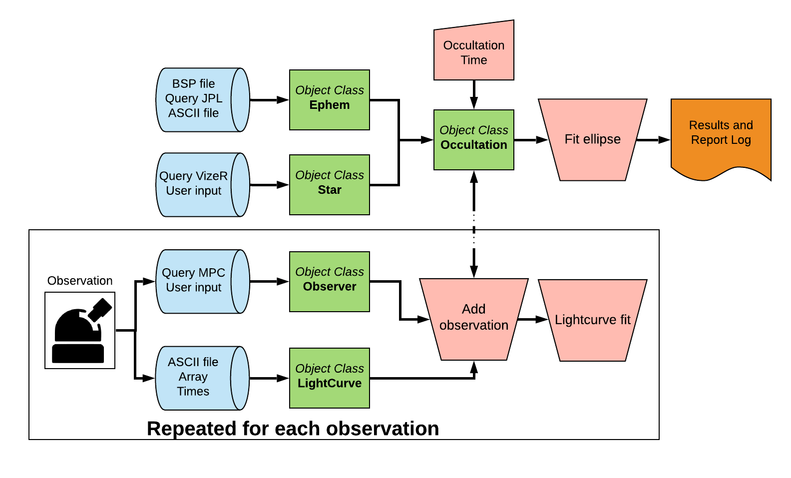

.. _Sec:general:

General
=====================

A stellar occultation occurs when a solar system object passes in front
of a star for an observer on Earth, and its shadow causes a temporary
drop in the observed flux of the star. This technique allows the
determination of sizes and shapes with kilometre precision and to obtain
characteristics of the object, such as its albedo, the presence of an
atmosphere, rings, jets, or other structures around the body (Sicardy et
al.
`2011 <https://ui.adsabs.harvard.edu/abs/2011Natur.478..493S/abstract>`__,
`2016 <https://ui.adsabs.harvard.edu/abs/2016ApJ...819L..38S/abstract>`__;
Braga-Ribas et al.
`2013 <https://ui.adsabs.harvard.edu/abs/2013ApJ...773...26B/abstract>`__,
`2014 <https://ui.adsabs.harvard.edu/abs/2014Natur.508...72B/abstract>`__,
`2019 <https://ui.adsabs.harvard.edu/abs/2019EPSC...13.1076B/abstract>`__;
Dias-Oliveira et al.
`2015 <https://ui.adsabs.harvard.edu/abs/2015ApJ...811...53D/abstract>`__;
Benedetti-Rossi et al.
`2016 <https://ui.adsabs.harvard.edu/abs/2016AJ....152..156B/abstract>`__,
`2019 <https://ui.adsabs.harvard.edu/abs/2019AJ....158..159B/abstract>`__;
Ortiz et al.
`2015 <https://ui.adsabs.harvard.edu/abs/2015EPSC...10..230O/abstract>`__,
`2017 <https://ui.adsabs.harvard.edu/abs/2017Natur.550..219O/abstract>`__;
Leiva et al.
`2017 <https://ui.adsabs.harvard.edu/abs/2017AJ....154..159L/abstract>`__;
Bérard et al.
`2017 <https://ui.adsabs.harvard.edu/abs/2017AJ....154..144B/abstract>`__,
Morgado et al.
`2019 <https://ui.adsabs.harvard.edu/abs/2019A%26A...626L...4M/abstract>`__,
Gomes-Júnior et al.,
`2016 <https://ui.adsabs.harvard.edu/abs/2016MNRAS.462.1351G/abstract>`__,
`2020 <https://ui.adsabs.harvard.edu/abs/2020MNRAS.492..770G/abstract>`__),
or even the detection of topographic features (Dias-Oliveira et al.
`2017 <https://ui.adsabs.harvard.edu/abs/2017AJ....154...22D/abstract>`__)
 [1]_.

Sora is a Python-based, object-oriented package for optimal analysis of
stellar occultation data. It includes processes starting on the
prediction of such events to the resulting size, shape and position of
the Solar System object. The main object classes created in version 0.1
are: **Star**, **Ephem**, **Observer**, **LightCurve** and
**Occultation**. It is important to note that new object classes,
modules and other improvements and implementations can be available in
future versions.

A stellar occultation is defined by the occulting body (**Ephem**), the
occulted star (**Star**), and the time of the occultation. On the other
hand, each observational station (**Observer**) will be associated with
their light curve (**LightCurve**). sora has tasks that allow the user
to determine the immersion and emersion times and project them to the
tangent sky plane, using the information within the **Observer**,
**Ephem** and **Star** Objects. That projection will lead to chords that
will be used to obtain the object’s apparent size, shape and position at
the moment of the occultation. Automatic processes were developed for
optimising the reduction of typical events. However, users have full
control over the parameters and methods and can make changes in every
step of the processes.

This package is intended to analyse Stellar Occultations data in the
context of big data and the LIneA TNO Portal. The user can use this
package to build pipelines to analyse stellar occultation’s data. An
example of a pipeline workflow is given in
Fig. `1 <#fig:pipeline_workflow>`__.

   functions and Classes. Using sora package the user can develop a
   customised pipeline to deal with specifics observations and
   occultations.
   :name: fig:pipeline_workflow

   Pipeline workflow example that can be developed using sora functions
   and Classes. Using sora package the user can develop a customised
   pipeline to deal with specifics observations and occultations.

In this document we present a general overview of the code and a brief
description on how all the developed modules and Object Classes work.
For the tests performed for science verification and validation see the
document in `this link <https://www.overleaf.com/read/ghdgdvrgjcfh
>`__. The last session contains some tips and hints for Python and
GitHub usage.

| The Object Classes developed within sora were built as an integrated
  system, and they are controlled by the **Occultation** Object Class.
  Combining these Object Classes and the functions therein, the user can
  perform the complete data reduction, pre- and post-occultation.
  Jupyter-Notebooks with the features of each Class can be found in the
  example folder. The sora package is hosted on a GitHub repository in
  the following link:
| https://github.com/riogroup/SORA

This package was developed with support of the ERC Lucky Star, that
agglomerates the efforts of the Paris, Granada, and Rio teams. The Lucky
Star is funded by the ERC (European Research Council) under the European
Community’s H2020 (2014-2020/ERC Grant Agreement No. 669416). Also, this
project is supported by LIneA (Laboratório Interinstitucional de
e-Astronomia), INCT do e-Universo (CNPQ grants 465376/2014-2), by FAPESP
(proc. 2018/11239-8) and by CNPQ (proc. 300472/2020-0), Brazil.